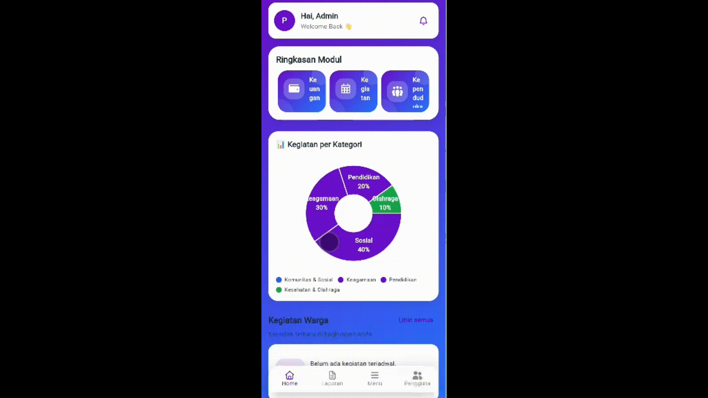
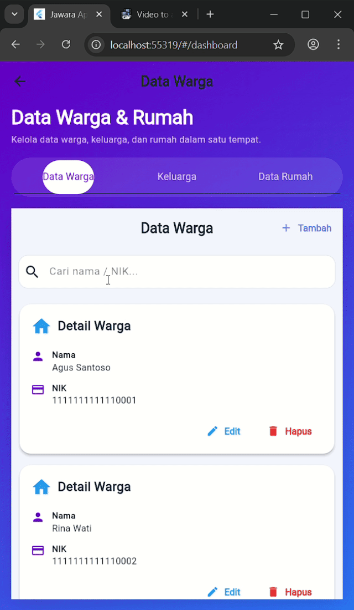
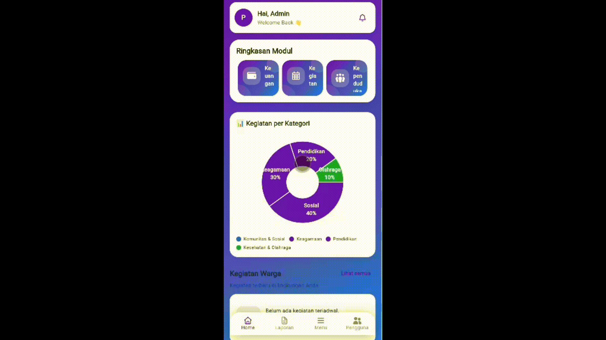
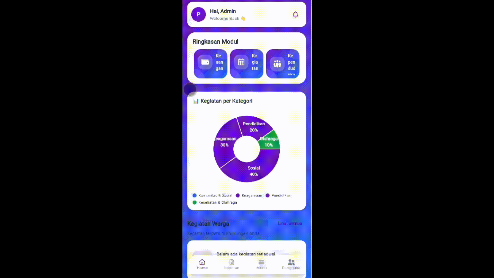
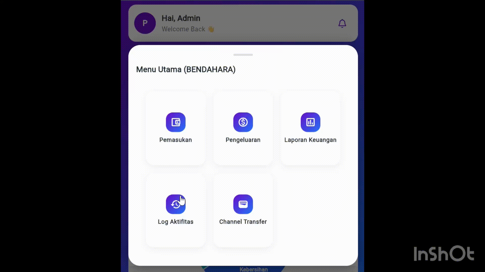
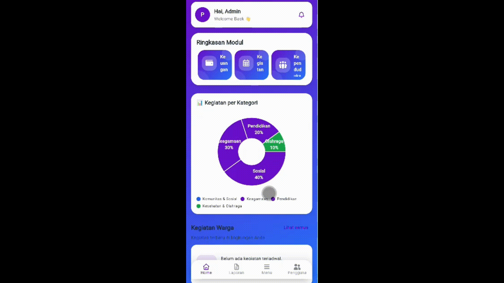

# JawaraMobile_1

JawaraMobile_1 adalah aplikasi mobile berbasis Flutter untuk mendukung digitalisasi sistem RT/RW.  
Aplikasi ini mencakup fitur administrasi warga, keuangan, komunikasi, kegiatan, hingga **fitur baru Marketplace Sayuran berbasis kamera**.

Backend diimplementasikan menggunakan RESTful API dengan satu database terpusat, sehingga seluruh role terintegrasi dalam satu sistem.

---

##  Tujuan Proyek

1. Mengimplementasikan **backend untuk seluruh fitur aplikasi RT/RW**.
2. Memastikan **setiap role memiliki minimal satu fitur** yang mengimplementasikan materi:
   - #09 Kamera  
   - #10 State Management  
   - #11 Asynchronous  
   - #12 Streams  
   - #13 Persistensi Data  
   - #14 RESTful API
3. Menambahkan **fitur baru: Marketplace Sayuran berbasis kamera** untuk warga.

---

##  Teknologi

- **Frontend**: Flutter  
- **Backend**: RESTful API (FastAPI / Laravel / Node – menyesuaikan dosen)  
- **Database**: MySQL / PostgreSQL (dev lokal boleh SQLite)  
- **Authentication**: Login warga & pengurus (JWT / token)  

> Semua role menggunakan async, REST API, dan state management.  
> Di laporan, penekanan materi disesuaikan per role.

---

## Role & Fitur Utama

### Mapping Role – Fitur – Materi

| Role | Fitur Utama | Materi (#09–#14) | Contoh Implementasi |
|-----|------------|------------------|---------------------|
| **Warga** | Marketplace Sayuran, Kegiatan, Aspirasi, Pesan Warga | #09 Kamera, #11 Async, #14 API | Ambil foto sayuran → upload ke `POST /marketplace/items` |
| **Ketua RT** | Pesan Warga, Broadcast RT, Kegiatan RT | #10 State Mgmt, #12 Streams, #14 API | Stream pesan warga real-time |
| **Ketua RW** | Dashboard Rekap RW, Laporan RW, Kegiatan RW | #10 State Mgmt, #11 Async, #14 API | Filter rekap per RT & bulan |
| **Bendahara** | Pemasukan, Pengeluaran, Laporan Keuangan, Channel Transfer | #13 Persistensi, #11 Async, #14 API | Cache transaksi lokal + sync server |
| **Sekretaris** | Data Warga, Mutasi Keluarga, Penerimaan Warga | #11 Async, #10 State Mgmt, #14 API | Search warga async + form state |
| **Admin Sistem** | Manajemen Pengguna, Log Aktivitas, Dashboard Global | #12 Streams, #13 Persistensi, #14 API | Stream log aktivitas & preferensi admin |

---

## API Endpoints (Implemented)

Dokumentasi berikut mencerminkan endpoint backend yang **sudah terimplementasi dan digunakan oleh aplikasi mobile**.

---

### Auth
| Method | Endpoint | Deskripsi |
|------|---------|----------|
| POST | `/auth/register` | Registrasi pengguna |
| POST | `/auth/login` | Login dan generate JWT |
| GET | `/auth/me` | Ambil data user login |

---

### Users (Admin Sistem)
| Method | Endpoint | Deskripsi |
|------|---------|----------|
| GET | `/users` | List seluruh pengguna |
| POST | `/users` | Tambah pengguna |
| PATCH | `/users/{id}` | Update role atau status pengguna |

---

### Logs (Admin Sistem)
| Method | Endpoint | Deskripsi |
|------|---------|----------|
| GET | `/logs` | List log aktivitas |
| GET | `/logs/latest` | Log terbaru (tanpa auth) |

---

### Activities / Kegiatan
| Method | Endpoint | Deskripsi |
|------|---------|----------|
| GET | `/activities` | List kegiatan (filter kategori) |
| GET | `/activities/{id}` | Detail kegiatan |
| POST | `/activities` | Tambah kegiatan |
| PATCH | `/activities/{id}` | Update kegiatan |
| DELETE | `/activities/{id}` | Hapus kegiatan |
| GET | `/activities/stats/by-category` | Statistik kegiatan per kategori |

---

### Broadcast
| Method | Endpoint | Deskripsi |
|------|---------|----------|
| GET | `/broadcast` | List broadcast |
| GET | `/broadcast/{id}` | Detail broadcast |
| POST | `/broadcast` | Tambah broadcast |
| PUT | `/broadcast/{id}` | Update broadcast |
| DELETE | `/broadcast/{id}` | Hapus broadcast |

---

### Pesan Warga
| Method | Endpoint | Deskripsi |
|------|---------|----------|
| POST | `/messages` | Kirim pesan warga |
| GET | `/messages` | List pesan (opsional only_mine) |

---

### Penerimaan Warga (Citizen Requests)
| Method | Endpoint | Deskripsi |
|------|---------|----------|
| POST | `/citizen-requests` | Ajukan pendaftaran warga |
| GET | `/citizen-requests` | List pengajuan |
| GET | `/citizen-requests/{id}` | Detail pengajuan |
| PUT | `/citizen-requests/{id}` | Approve / Reject |
| DELETE | `/citizen-requests/{id}` | Hapus pengajuan |

---

### Houses
| Method | Endpoint | Deskripsi |
|------|---------|----------|
| GET | `/houses` | List rumah |
| GET | `/houses/{id}` | Detail rumah |
| POST | `/houses` | Tambah rumah |
| PUT | `/houses/{id}` | Update rumah |
| DELETE | `/houses/{id}` | Hapus rumah |
| GET | `/houses/{id}/families` | Family per rumah |

---

### Families
| Method | Endpoint | Deskripsi |
|------|---------|----------|
| GET | `/families` | List keluarga |
| GET | `/families/extended` | Keluarga + jumlah anggota |
| GET | `/families/{id}` | Detail keluarga |
| POST | `/families` | Tambah keluarga |
| PUT | `/families/{id}` | Update keluarga |
| DELETE | `/families/{id}` | Hapus keluarga |
| GET | `/families/{id}/residents` | Anggota keluarga |

---

### Residents
| Method | Endpoint | Deskripsi |
|------|---------|----------|
| GET | `/residents` | List warga (search nama/NIK) |
| GET | `/residents/{id}` | Detail warga |
| POST | `/residents` | Tambah warga |
| PUT | `/residents/{id}` | Update warga |
| DELETE | `/residents/{id}` | Hapus warga |

---

### Mutasi
| Method | Endpoint | Deskripsi |
|------|---------|----------|
| GET | `/mutasi` | List mutasi |
| GET | `/mutasi/{id}` | Detail mutasi |
| POST | `/mutasi` | Tambah mutasi |
| PUT | `/mutasi/{id}` | Update mutasi |
| DELETE | `/mutasi/{id}` | Hapus mutasi |

---

### Fee Categories
| Method | Endpoint | Deskripsi |
|------|---------|----------|
| GET | `/fee-categories` | List kategori iuran |
| POST | `/fee-categories` | Tambah kategori |
| PATCH | `/fee-categories/{id}/status` | Update status kategori |

---

### Bills
| Method | Endpoint | Deskripsi |
|------|---------|----------|
| GET | `/bills` | List tagihan |
| POST | `/bills/bulk-create` | Generate tagihan massal |
| POST | `/bills/send-notifications` | Data notifikasi tagihan warga |

---

### Income Transactions
| Method | Endpoint | Deskripsi |
|------|---------|----------|
| GET | `/income-transactions` | List pemasukan |
| POST | `/income-transactions` | Tambah pemasukan |

---

### Expenses
| Method | Endpoint | Deskripsi |
|------|---------|----------|
| GET | `/expenses` | List pengeluaran |
| POST | `/expenses` | Tambah pengeluaran |

---

### Payment Channels
| Method | Endpoint | Deskripsi |
|------|---------|----------|
| GET | `/payment-channels` | List channel pembayaran |
| POST | `/payment-channels` | Tambah channel pembayaran |

---

### Marketplace (Warga)
| Method | Endpoint | Deskripsi |
|------|---------|----------|
| GET | `/marketplace/items` | List item marketplace |
| GET | `/marketplace/items/{id}` | Detail item |
| POST | `/marketplace/items` | Tambah item + upload gambar |
| POST | `/marketplace/analyze-image` | Analisis gambar sayuran (AI) |

---

### AI Agent
| Method | Endpoint | Deskripsi |
|------|---------|----------|
| POST | `/ai/marketplace/analyze` | Gateway ke AI Agent |

---

### Reports
| Method | Endpoint | Deskripsi |
|------|---------|----------|
| GET | `/reports/generate` | Generate laporan keuangan PDF |

---

## Tim Kelompok 1

| Anggota | Fokus Role & Fitur | Materi Utama (#09–#14) |
|-------|--------------------|------------------------|
| **Gabriel Batavia Xaverius** | Lead backend & integrasi, **seluruh Modul Warga (Marketplace, Aspirasi, Pesan, Kegiatan)**, Admin Sistem (Manajemen Pengguna & Log Aktivitas), setup auth & HTTP client | #09 Kamera, #11 Async, #12 Streams, #13 Persistensi, #14 REST API |
| **Lina** | Modul Keuangan / Bendahara: Pemasukan, Pengeluaran, Laporan Keuangan, Channel Transfer | #13 Persistensi, #11 Async, #14 REST API |
| **Firdaus** | Modul Ketua RT & Ketua RW: Pesan Warga, Broadcast, Dashboard & Laporan RW | #10 State Mgmt, #12 Streams, #11 Async, #14 API |
| **Kibar** | Modul Sekretaris: Data Warga, Mutasi Keluarga, Penerimaan Warga | #11 Async, #10 State Mgmt, #14 API |

## Tampilan JawaraMobile

### Broadcast

---

### Channel Transfer (Bendahara)

---

### Data Keluarga

---

### Data Rumah

---

### Data Warga

---

### Kegiatan (Pengurus)

---

### Kegiatan (Warga)

---

### Laporan Keuangan (Bendahara)

---

### Laporan

---

### Log Aktivitas (Bendahara)

---

### Marketplace (Warga)

---

### Pemasukan (Bendahara)

---

### Pengeluaran (Bendahara)

---

### Pesan (Pengurus)

---

### Pesan Warga

---
